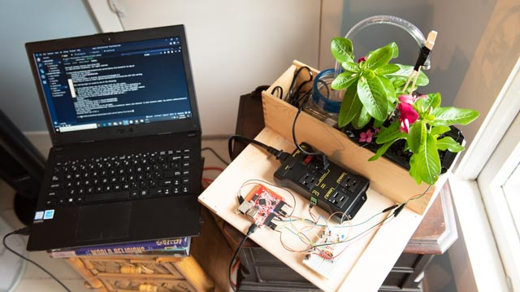

# Soil Server
- https://soil-server-main.herokuapp.com/
- https://github.com/Mday1313/johnny-five-tessel

## Group Name: _Short Circuit_
## Project Manager: _Melissa_
## Other Members: _Diana, John, Anthony_
## Description: 
* Bot run with Javascript using the Johnny-fve kit and Tessel2. This bot will water your house plants remotely. User will have have option to water on a timer, by alert when soil moisture reaches a certain level. The data will be collected for soil moisture level, humidity, temperature and air pressure. The browser will integrate both controls for the bot and as well as a styled graph with the returned data.
*note tessel functionality only ran locally, did not diploy to application*
Technologies used:
handlebars,
mysql,
passport authentication,
d3 graphs,
node js,
johnny five inventors kit with tessel microcontroller,
express

Problem addressed: An application to assist a user care for thier plants by monitoring soil mosture level, humidity, and temperature. The user is able to water the plant when needed remotely using a water pump controlled by the application to ease the burden of when to water especially when not home.

